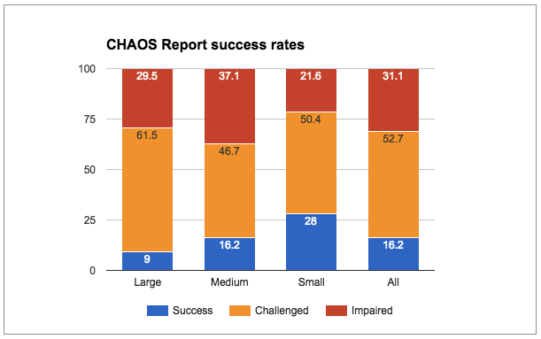
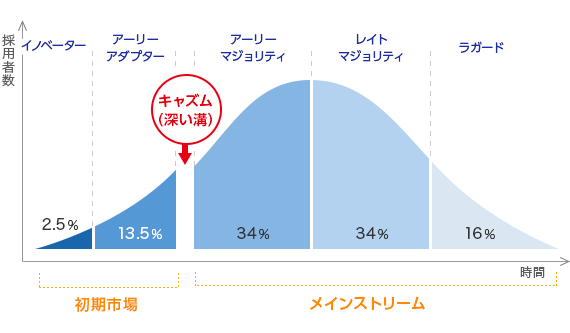

## 2章 CHAOSレポート再考
- CHAOSレポートではソフトウェアプロジェクトの成功率がわずか3割程度であることが示された。
  
- CHAOSレポートの成功・問題あり・失敗の定義には問題がある。
  - このレポートからはプロジェクトマネジメントチームの見積もり能力の高さしか分からない
- しかし、ソフトウェアプロジェクトの成功率が低いことは言うまでもなく明らか
- なぜ成功率が低くなるのか
  - 理由1：コードの変更にコストがかかること
    - 「使われる」ソフトウェアは変更が必ず必要
    - ソフトウェアの多くは機能追加のことを考えた設計をされていないため、大規模なソフトウェアへの機能追加のために、コードリーディングが必要だが、これには膨大な時間がかかる。
    - 開発者はコードを読むことなく自己流のやり方で機能を追加してしまう。
    - さらにコードの品質が下がる悪循環
  - 理由2：バグ修正にコストがかかる
    - バグを見つけるのに時間がかかる
       - 例）Mac OS Xのソースコードは8500万行
    - 1つのミスにより全体のシステムがクラッシュしかねない
    - 軽微なバグが修正しているうちにシステム全体の問題と発覚することも少なくない
  - 理由3：ソフトウェアの複雑さが増大し続けてしまう
    - NISTのコメント「開発者のリソースの80%が障害の特定と修正に使われている」
    - ソフトウェアが書きやすさを優先して作られ続け、依存性にまみれてしまう。
    - 実に45%もの機能が文字通り「使われない」
      - マーケティングとしては多機能な方が訴求しやすい
    - 機能を付け足すのは簡単。しかし、その「ちょっと」がちりつもとなり、保守に予想外に膨大な時間がかかるようになってしまう。
- ソフトウェア障害によりかかっている無駄コストはアメリカ合衆国全体で600億ドル
- 保守にかかるコストの経済的インパクトを誰も知らなかったため、ソフトウェアの開発時に保守のことを考えなかった。結果、保守に膨大なコストがかかるようになった。

## 3章 賢人による新しいアイデア
- アジャイル的なプラクティスにより保守・運用コストを低く抑えつつソフトウェアを開発できる。
- アジャイルの利点＝ソフトウェア開発がディスカバリープロセスになる
    ```mermaid
    graph TD;
    開発者 -- デプロイ --> ユーザー;
    ユーザー -- フィードバック --> 開発者;
    ```
- アジャイルのプラクティスの目的を正しく理解して取り入れることが大切
- 学校ではソフトウェア開発の技能は教えてもらえるが、アジャイル開発とその実践に必要なプラクティスについては教えられない
- ソフトウェア開発に必要なもの：ソフトウェア開発技能＋対象固有の知識
- アジャイルがキャズムを超えつつある。しかし、アジャイルは真に理解されて使われているとは言えない場合も多い
  
- アジャイルの背後にある原則を正しく理解し、技術プラクティスを適切に適用できれば、保守可能なソフトウェアを作ることができる
- 第2部でアジャイルの9つのプラクティスの目的と適切な適用方法を説明していく

    
