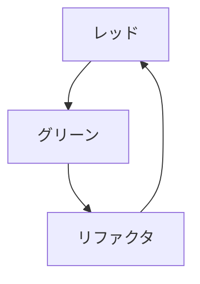

# テストでふるまいを明示する
## 11.1~11.4 テストファースト開発の実演
[コミットログ](https://github.com/kikugawa-shoma/reading_circle/commits/master/Beyond_legacy_code/python)で説明


## 11.5 テストは仕様だ
- 各テストは1つの理由だけで失敗する（ようにユニットテストを作成するべき）

- ユニットテストの大きな利点の1つ
  - ドキュメントがアップデートされているかを確認することは難しい
  - 反面、ユニットテストは正しいことをボタンひとつで証明できる
- ユニットテストは「生きた仕様」
  - コードと乖離することがあり得ない

## 11.6 完全であれ
- 対象のふるまいのすべてをテストがカバーするようにすべき
- テストにないふるまいは仕様ではない
- QAはTDDと混ぜるな危険
  - ユニットテストが担保できる（すべき）範囲とQAが担保できる（すべき）範囲は別

## 11.7 テストを一意にする
- 良いテスト = 「既知の理由で失敗し、その理由で失敗するテストは1つ」
- どのテストが失敗したか、から失敗原因が分かるのが理想
- SRP

## 11.8 コードをテストでカバーする
- TDDをすれば自ずとカバレッジは100%になる
- パスが増えると指数関数的にテストが増える -> TDDで関数やクラスをテスト可能な規模にするインセンティブになる
    3*3 = 9通りのテストが必要
    ```mermaid
    graph TD;
        A-->B;
        A-->C;
        A-->D;
        B-->E;
        C-->E;
        D-->E;
        E-->F;
        E-->G;
        E-->H;
        F-->I;
        G-->I;
        H-->I;
    ```


## 11.9 バグにはテストがない
- 当然
- 理想形
    - 文法誤り -> コンパイラによるチェック
    - ロジックの誤り -> ユニットテストでチェック


## 11.10 モックを使ったワークフローテスト
- 開発を進めれば普通は外部のコードに依存する
- 呼び出すモジュールをモックすることでテストが可能になる
- どのような引数で呼ばれたか、何回呼ばれたかも確認できる
  - https://jestjs.io/ja/docs/mock-functions

## 11.11 セーフティネットを作る
- 転ばぬ先の杖
- 安心していろいろなことを試すことができる

## テストを仕様として使うための7つの戦略
- テストを文書のように扱えるようにする
  - マジックナンバーを使わない
- 意図がはっきりわかる名前のついたヘルパーメソッドを使う
- 何が重要なのかを明らかにする
  - テストで使う関数や変数の命名
- 実装ではなくふるまいをテストする
  - ふるまいにもとづいた命名をする
- モックを使ってワークフローをテストする
- 書きすぎない
- 正確な例を使う


## バグを修正する7つの戦略
- そもそもバグを作らない
- できるだけ早くバグを見つける
- バグを見つけられるように設計する
  - バグの箇所を素早く特定できるようなコードを書く
- 正しい質問をする
- バグをテストの不足とみなす
- 欠陥をもとにプロセスを修正する
  - ツールに任せて防げた部分はないか
- 失敗から学ぶ
  - バグを修正するだけでは足りない。バグを生み出すに至った開発プロセスの改善余地を探す


