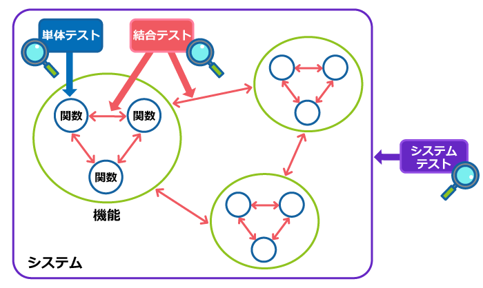
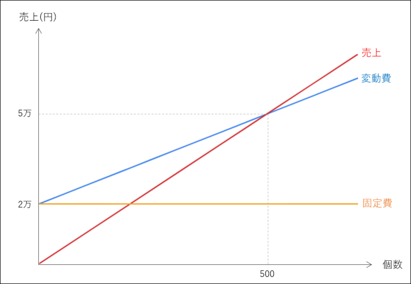

# ７章:継続的に統合する

- ビルド:単体テスト、結合テスト
- 統合:システムテスト

## 7.1 プロジェクトの鼓動を確立する
-  CI = プロジェクトの心臓の鼓動
- バックグラウンドで、意識せずとも勝手に、定期的に、ビルドされる状態であるべき
- ユニットテストを作成するのは初期コストがかかるが、元を取れる
  - リリースの検証を自動化できる
  - さらに、システムをどう変えるかをシステムを動かして知ることができるようになる

---
- テストがあるとき:「機能追加する -> テストを書く -> テスト動かす(一瞬) -> テストが通るように修正する」
- テストがないとき:「機能追加する -> 手動テストを計画する(新規も回帰も含め)」 -> テストが通るように修正する
- テストコードを書くことによる損益分岐点は思ったより速く来る

## 7.2  完了と、完了の完了と、完了の完了の完了が違うことを知る

- ソフトウェア開発における機能開発の「完了」とは
  - ローカルで動くことを確認
  - かつ、ビルドも通っている
  - かつ、保守性が保たれている

---

## 7.3 継続的にデプロイ可能にする
- CI != 継続的にデプロイ「しなければいけない」ということではない
- CI != イテレーション毎にデプロイ「しなければいけない」ということでもない
- 「要望があればいつでもデプロイできる」ことが大切
- ビルドに必要なファイルすべてをバージョン管理する
  - 「すべて」は文字通り「すべて」
- 本番環境とテスト環境の差をなるべくなくす

---
- データ鮮度の問題もある

## 7.4 ビルドを自動化する
- ビルドは速くあるべき
  - ローカルビルド：数秒以内
  - ビルドサーバー：10分以内

- ビルドに時間がかかる場合は、
  - テストするモジュールを作業中のものとそれに依存するもののみに限定する
    - モジュールの依存関係を理解し、あるべき分離をについて考える契機になる
  - システムを正しく分離する
  - テストを改善する(後の章で詳しく説明)

---

## 7.5 早期から頻繁に統合する
- 統合はボタンひとつで簡単にできるようにし、頻繁に行う
- 統合する頻度が少ないと修正が大変になる

---
- 週1統合でも足りない(組織の規模にも依るが)
  - どの変更をリバートすべきかを特定するのに時間がかかる
- カナリアリリースは頻繁な統合に寄与するか?

## 7.6
- 継続的に統合する
  - 未完成の機能はフィーチャーフラグを使ってスイッチできるように
  - コンポーネントをモックする
  - リグレッションのためのユニットテストを追加
---
- やらない理由を見つけるのは簡単
- フィーチャーフラグを使って「出して」おくことで無用なコンフリクトを避けられる
