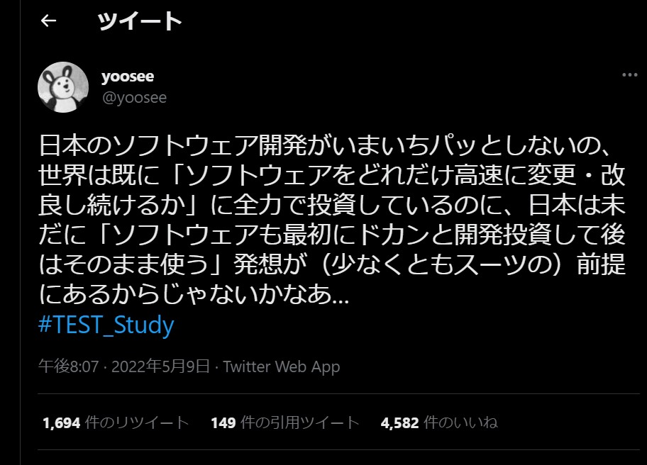

# 「CLEAN」コードを作る

コードの品質を測る5つの指標・観点

- cohesive（凝集性）
- loosely coupled（疎結合）
- encapsulated（カプセル化）
- assertive（断定的）
- nonredundant（非冗長）

これら5つは関連し合っている
## 高品質のコードは凝集性が高い
- 単一責任の原則に基づき、1つのクラスが１つの責任（機能）を持つようにする
- 手続き型に書かれたコードを読むのは辛い -> 宣言的に書かれたものを読むのはこれに比べればまし
  - コードリーディングのレベルを必要に応じて調整できる(具体クラスから抽象クラスへと)
  - [ネットワークのトラブルシューティング](https://avinton.com/blog/2017/10/linux-network-troubleshooting/)のようにシステムを辿ることができる
- 抽象化層は全体を捉えてコンポーネントがそれぞれどう関連するかを理解するのに役立つ
  - https://qiita.com/aiko_han/items/e8ddce85188970fd77da
  - 抽象商品クラス -> 通常商品クラス、カスタマイズ商品クラス、医家向け商品クラス
  - 具象クラスが共通で持っている（べき）メソッド、プロパティが一発で分かる

- 命名し辛い = 単一責任になっていない
- 複雑なものは複数のクラスのコンポジションで表現する
  - [継承とコンポジションの使い分け](https://4geek.net/difference-between-inheritance-and-composition/)
  - A is a Bの関係なら継承
  - A has a Bの関係ならコンポジション
  - コード例が分かりやすくて参考になった

## 高品質のコードは疎結合である
- 疎結合が良いとされるのは理解できるはず
  - 疎結合なシステムはテストがしやすい、変化に強い
- 中間層を設けることで疎結合にできる
  - 例[BFF](https://qiita.com/souhei-etou/items/d5de99bb8cba1c59d393)
- 筆者は「疎」であればあるほど良いとは言っていない
- 意図しない結合が生まれないようにすべきと言っている
- 単一責任の原則を外れると意図しない結合が生まれてしまう
  - [イメージ図](https://docs.google.com/presentation/d/1f0PpIDddg-eIpEQOZJ5mL1pJlG_EPhFfnd60Ew4ADVw/edit#slide=id.g134e21c3752_0_0)

## 高品質のコードはカプセル化されている
- まずそもそも「カプセル化」とは
  - [参考](https://docwiki.embarcadero.com/Support/ja/C%2B%2B%E3%81%AE%E5%9F%BA%E7%A4%8E:%E3%82%AB%E3%83%97%E3%82%BB%E3%83%AB%E5%8C%96%E3%81%AB%E3%81%A4%E3%81%84%E3%81%A6%E5%AD%A6%E3%81%B6)
  - 関連のあるデータと処理を一つにまとめる。
  - クラスのデータにアクセスできないようにして、アクセスする必要があるものについてはgeterとsetterを用意するようにする
  - デザインパターン勉強したい
    - [GoF本](https://www.amazon.co.jp/%E3%82%AA%E3%83%96%E3%82%B8%E3%82%A7%E3%82%AF%E3%83%88%E6%8C%87%E5%90%91%E3%81%AB%E3%81%8A%E3%81%91%E3%82%8B%E5%86%8D%E5%88%A9%E7%94%A8%E3%81%AE%E3%81%9F%E3%82%81%E3%81%AE%E3%83%87%E3%82%B6%E3%82%A4%E3%83%B3%E3%83%91%E3%82%BF%E3%83%BC%E3%83%B3-%E3%82%A8%E3%83%AA%E3%83%83%E3%82%AF-%E3%82%AC%E3%83%B3%E3%83%9E/dp/4797311126)が有名
- 実装とインターフェースが分離されている
- 「何をやるのか」と「どうやるのか」が切り離されている
  - ライブラリを使うときに、その実装を見ないと使うことができないのは明らかに良くない
  - 副作用のことを考えながらオブジェクトや関数を扱うのも嫌

## 高品質のコードは断定的である
- (問)ドキュメントの印刷を制御するコードはドキュメントクラスに追加すべきか、プリンタークラスに追加すべきか
- (答)ドキュメントクラスがプリンタークラスへ印刷できるように情報を渡すようにすべき
- オブジェクト自分自身のフィールドやプロパティに関する処理そのオブジェクトが管理するべき
  - 内政不干渉
- クラス設計を正しく行うことで、オブジェクトを自己責任的にできる

## 高品質なコードは冗長でない
- DRY
- ミッションクリティカルなシステムでは冗長性は必要。意図しない冗長性が排除されるべき
  - セキュリティに関する事項もミッションクリティカルだと思った
- 冗長なコードがあると、保守にかかるコストが増える
  - 読むのも、修正するのも
- 冗長性とは形状の繰り返しではなく、意図の繰り返し
  - コードが大きくなるにつれて、自分が書いたコードが冗長でないかどうか判断するのは難しくなりそう。

## コード品質が私たちを導いてくれる
- CLEANなコード品質はお互いに関連し合っている
- 一つを改善すれば他の品質も自然と改善する。おすすめは凝集性に着目すること
- 「テストのしやすさ」でCLEANの尺度を測ることができる
  - だからテスト駆動だと自ずと品質が良くなるのか

## 明日のベロシティのために今日品質をあげる
- 今日の時間をコードの品質を上げることに使えば、未来の開発速度が向上する
  
- 料理人の話「私には汚くする時間がない」
